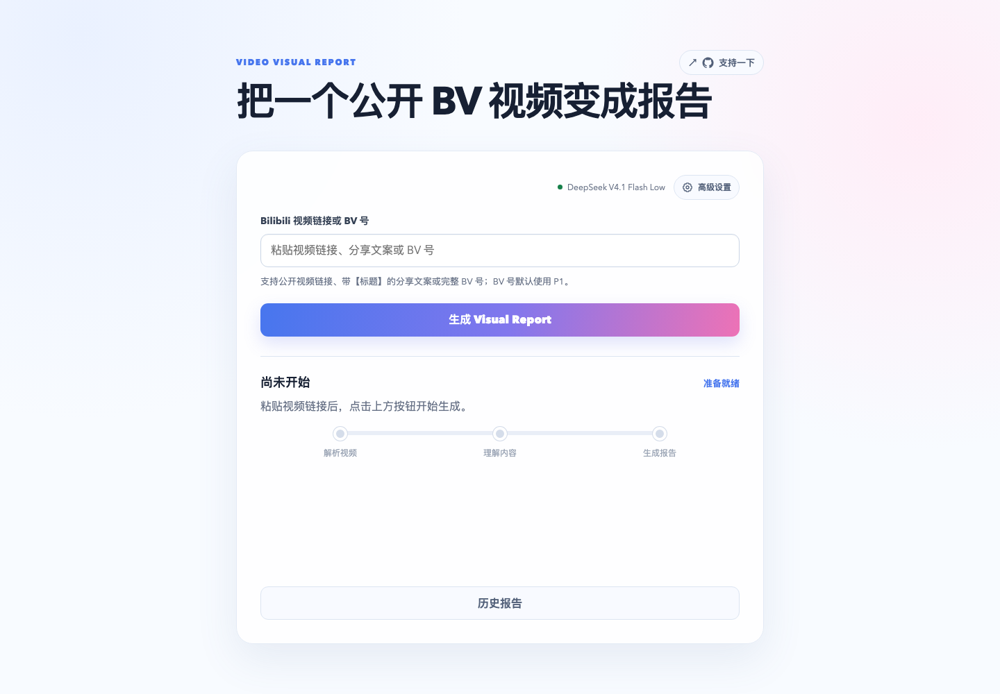
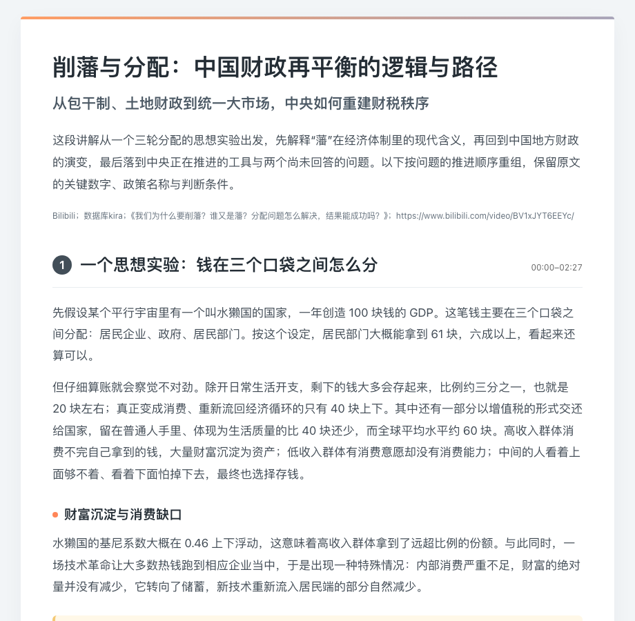

# Video Report Agent

[简体中文](README.zh-CN.md) | English

Turn video transcripts into self-contained HTML reading reports. **Use ASR + the video-report Skill in your own Coding Agent, without deploying this project.**

The developer runs MLX Whisper locally on an Apple Silicon Mac. That is the developer's setup: Windows users can choose an ASR model compatible with their own hardware or use a speech-to-text API, then pass the transcript to the Skill.

## Quick start: use your own Coding Agent

> Video / audio → your choice of ASR → transcript → Coding Agent + video-report Skill → report.html

### 1. Prepare a transcript

Transcribe the video or audio with your own ASR tool or API and save the result as `transcript.md`, TXT, SRT, or another format your Agent can read. Reuse complete subtitles or an existing transcript when available.

- Apple Silicon: the developer uses MLX Whisper.
- Windows and other platforms: use a local ASR compatible with your system and hardware, or a cloud speech-to-text API.
- Preserve timestamps, speaker information, and the full text where available. A transcript without reliable timestamps still works; the report should omit unsupported chapter times.

ASR converts speech to text. Your Coding Agent's model reads that text and creates the HTML report. You can choose these services independently.

### 2. Get the Skill and template

Download the repository, or copy just the complete [`src/video_report_agent/skills/video-report/`](src/video_report_agent/skills/video-report/) directory. Keep `SKILL.md` and `assets/` together with their relative paths intact.

Arrange your working folder as follows:

```text
my-report/
├── transcript.md
├── video-report/
│   ├── SKILL.md
│   └── assets/
│       └── report-template.html
└── output/
```

You do not need this project's Python backend, Pi RPC, or Web UI. Use a Coding Agent that can read local files and write HTML, with its own model configured. If it supports Skills, install the directory using its conventions; otherwise, explicitly ask it to read the instructions from the file.

### 3. Ask your Agent to generate the report

Open your Coding Agent in that working folder and send:

```text
Read video-report/SKILL.md and follow its instructions.
Use video-report/assets/report-template.html as the default style foundation.
Read transcript.md in full and produce a self-contained HTML reading report.

Use output/ as this task's output directory and write output/report.html.
Preserve important conditions, numbers, formulas, attribution, and uncertainty.
Include chapter times only when reliable source timestamps are available.
Do not modify the original transcript. If browser tools are available, inspect
the page layout; otherwise, state that only static checks were performed.
```

Open `output/report.html` in a browser. The Skill guides content organization, source fidelity, and layout. Results depend on transcript quality, the Agent's model, and available tools. The Skill does not include an ASR engine or configure your transcription service.

## Preview

**Web homepage · default state**



**Sample report · China's fiscal rebalancing (in Chinese)**

The image below shows the top of the report. Follow the links for the complete report without expanding the entire long image in this README.

[](docs/examples/report.png)

↗ 🔗 [HTML report](docs/examples/report.html) · [Full PNG](docs/examples/report.png)

On GitHub, the HTML link opens the file page; download it and open it in a browser to read. The example files are included in the repository and do not require a running local service.

## Optional: run the complete local project

Run the local Web UI if you want to paste a Bilibili URL and automate downloading, transcription, report generation, and report history.

> Bilibili URL → yt-dlp → FFmpeg → ASR → Canonical Transcript → Pi RPC + Skill → report.html

### Requirements and installation

Install Python 3.12, uv, `ffmpeg` / `ffprobe` on `PATH`, and Pi 0.85.0. Configure credentials for your report model. `uv sync` does not install Pi. Run these commands from the repository root.

For local MLX on Apple Silicon:

```sh
uv sync --extra mlx
uv run playwright install chromium
```

For the built-in cloud ASR path, MLX is unnecessary:

```sh
uv sync
uv run playwright install chromium
```

Copy `.env.example` to `.env` and configure the report model:

```dotenv
PI_PROVIDER=deepseek
PI_MODEL=deepseek-flash
PI_API_KEY=your-api-key
```

### Choose ASR

The developer's local Apple Silicon configuration:

```dotenv
ASR_BACKEND=mlx
ASR_MODEL=mlx-community/whisper-large-v3-turbo
```

For the built-in Bailian file-transcription API:

```dotenv
ASR_BACKEND=paraformer
ASR_MODEL=paraformer-v2
DASHSCOPE_API_KEY=your-dashscope-api-key
```

The `paraformer` backend supports `paraformer-v1`, `paraformer-v2`, and the Fun-ASR file-transcription models adapted in the code. Restart the local service after changing its environment. Cloud ASR uploads audio; the report model receives transcript content needed for generation.

**Standalone Skill use lets you choose any external ASR workflow. The project pipeline currently includes only the `mlx` and `paraformer` backends.** Other local models or APIs require an adapter, not just a model-name change. Windows users can start with the standalone Skill workflow above; native Windows execution of the complete project is not presented here as verified.

### Start and generate

```sh
uv run video-report web --port 8765
```

Open [http://127.0.0.1:8765](http://127.0.0.1:8765), paste a public Bilibili HTTPS URL or full BV number, and click **生成 Visual Report**. Use `?p=2` to select a page in a multi-page video.

Or use the CLI:

```sh
uv run video-report generate 'https://www.bilibili.com/video/BV...' --transcript-mode asr-only
```

Outputs are saved in `runs/<run-id>/`, including `transcript.md`, provenance records, and `report.html`. The local Web UI also offers a Chromium-generated full-page screenshot, `report.png`.

## Project behavior and boundaries

- ASR-only with OCR off is the default. Optional `fused` mode supports subtitle import, OCR, and fusion. Install its dependencies with `uv sync --extra enhancement`; include `--extra mlx` as well when using MLX.
- Every generation uses its own `runs/<run-id>/` working directory. Pi owns the Agent loop, tools, and context management; the Skill defines report-editing requirements.
- Videos are limited to 3 hours. Tasks have a 30-minute execution deadline, excluding queue time. Already-submitted cloud ASR may continue and incur charges after a local task stops.
- Ingestion supports public Bilibili videos, without login or private-video access. Check generated content against the original source as needed.
- Pi uses local file and shell tools. A dedicated working directory is a workspace convention, not an operating-system sandbox.

## Development checks

```sh
uv run --extra enhancement pytest -q
uv run ruff check src tests
uv lock --check
```

See [`video-report/SKILL.md`](src/video_report_agent/skills/video-report/SKILL.md) for report-writing instructions and [`report-template.html`](src/video_report_agent/skills/video-report/assets/report-template.html) for the default styles.
