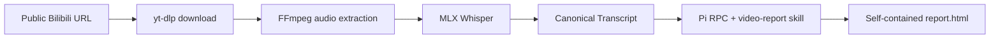

# Video Report Agent

[简体中文](README.zh-CN.md) | English

Turn a public Bilibili video into a self-contained HTML reading report on Apple Silicon macOS.

> `Bilibili URL → yt-dlp → FFmpeg → MLX Whisper → Canonical Transcript → Pi RPC → report.html`

## At a glance

| | Current behavior |
| --- | --- |
| Input | A public HTTPS Bilibili video URL or a full BV number. `?p=2` selects a page in a multi-page video. |
| Default path | ASR-only transcription with OCR disabled. |
| Optional path | Subtitle discovery/import plus conservative local OCR and Fusion. |
| Output | A timestamped transcript, provenance artifacts, and a self-contained `report.html`. |
| Runtime | Local macOS tool; one worker processes runs sequentially. |
| Report model | Pi RPC calls the provider and model selected in `.env` or the web UI. |

## Quick start

### Requirements

- Apple Silicon macOS, because the default ASR backend uses MLX Whisper.
- Python 3.12.
- `ffmpeg` and `ffprobe` available on `PATH`.
- Pi 0.85.0 available on `PATH`.
- A configured model provider and credential. The example environment uses DeepSeek.

### Install and configure

```sh
uv sync --extra mlx
cp .env.example .env
```

Set the provider, model, and credential in `.env`:

```dotenv
PI_PROVIDER=deepseek
PI_MODEL=deepseek-v4-flash-vision-exp
PI_API_KEY=your-api-key
```

`PI_API_KEY` may be left empty when the selected provider is logged in through the project Pi directory. The interactive login command is:

```sh
PI_CODING_AGENT_DIR="$PWD/config/pi" pi
# Run /login inside Pi.
```

### Start the web UI

```sh
uv run video-report web --port 8765
```

Open [http://127.0.0.1:8765](http://127.0.0.1:8765), paste a public Bilibili URL or BV number, and click **生成 Visual Report**. The UI shows progress, lets you select the report model, and keeps a history of completed reports.

### Run from the CLI

```sh
uv run video-report generate \
  'https://www.bilibili.com/video/BV...' \
  --transcript-mode asr-only
```

The command prints the run status as JSON. The generated report is stored at `runs/<run-id>/report.html`.

Use a separate run root by placing the global option before the subcommand:

```sh
uv run video-report --runs /path/to/runs generate 'https://www.bilibili.com/video/BV...'
```

The first run may download `mlx-community/whisper-large-v3-turbo`.

## Transcript modes

The canonical transcript is the boundary between media processing and report generation. Pi receives the same `transcript.md` projection regardless of the selected mode.

| Mode | What it does | When to use it |
| --- | --- | --- |
| `asr-only` | Generates the transcript from MLX Whisper. OCR is off and no subtitle lookup is performed. | Fast default path and baseline checks. |
| `fused` | Keeps ASR as the timeline anchor, then optionally discovers subtitles, imports a local subtitle file, samples local OCR, and records source provenance. Optional-source failures are retained as warnings. | When on-screen subtitles or an existing subtitle track can improve the transcript. |

The CLI examples below use Fusion explicitly:

```sh
# Subtitle discovery and automatic OCR ROI detection.
uv run video-report generate 'https://www.bilibili.com/video/BV...' \
  --transcript-mode fused \
  --ocr-mode auto

# A known subtitle area, expressed as normalized x1,y1,x2,y2 coordinates.
uv run video-report generate 'https://www.bilibili.com/video/BV...' \
  --transcript-mode fused \
  --ocr-mode roi \
  --ocr-roi 0.05,0.72,0.95,0.98

# Import a local SRT, VTT, or ASS subtitle file.
uv run video-report generate 'https://www.bilibili.com/video/BV...' \
  --transcript-mode fused \
  --subtitle-file ./captions.srt
```

OCR modes are:

- `off`: no OCR; this is the default.
- `auto`: detect a stable subtitle region and fall back when the region is unstable.
- `roi`: use the explicit `--ocr-roi` rectangle. CLI `on` is accepted as an alias for `roi`.

The web UI exposes the same transcript, OCR, and subtitle settings under **高级设置**. OCR is only used when `fused` is selected. The optional enhancement dependencies are installed with:

```sh
uv sync --extra mlx --extra enhancement
```

## How the pipeline works



Each run has its own workspace under `runs/<run-id>/`. The adapter copies the report skill and its assets into that workspace, starts Pi with `--mode rpc`, and points Pi at the run-local transcript. It waits for `agent_settled`, verifies a normal final assistant stop, and checks that `report.html` is a complete HTML document.

Pi owns the agent loop, tool execution, retries, and compaction. This product does not add a planner, critic, revision workflow, or multi-agent orchestration. A browser hard gate is not part of the generation path.

## Run artifacts

Important files in a completed run look like this:

```text
runs/<run-id>/
├── input.json
├── status.json
├── download/
│   ├── source.<ext>
│   └── source.info.json
├── audio.wav
├── asr.json
├── transcript.md
├── canonical-transcript.jsonl
├── transcript-manifest.json
├── SKILL.md
├── assets/
├── sessions/
├── invocation.json
├── pi.events.jsonl
├── pi.stderr.log
└── report.html
```

Fusion runs may also contain downloaded or imported subtitles, `subtitle-ocr-events.jsonl`, OCR frame candidates, and related diagnostic files. Failed runs retain their files and add `failure.log`; they are not silently replaced by a successful result.

## Model and project configuration

- The CLI loads `.env` from the project root. Environment variables already present in the process take precedence.
- `PI_PROVIDER`, `PI_MODEL`, and `PI_API_KEY` select the report model. The web UI can select a configured Pi model or save a custom OpenAI-compatible provider.
- `config/pi/models.json` is versioned project configuration. Credentials and Pi runtime state stay outside Git.
- Report runs always set `PI_CODING_AGENT_DIR` to the project `config/pi/` directory, so user-level Pi credentials, models, and settings are not loaded accidentally.
- The project-level Pi executable is still an external prerequisite. `uv sync` does not install Pi.

## Storage and media retention

Cleanup runs when the web server starts and after each generation. It only removes downloaded MP4 files and `audio.wav` from successful runs.

| Variable | Default | Meaning |
| --- | ---: | --- |
| `MEDIA_KEEP_LAST` | `20` | Keep media for the latest 20 successful runs. |
| `MEDIA_MAX_AGE_DAYS` | `0` | Disable age-based cleanup. Set a positive value to remove older media. |

Set either limit to `0` to disable that limit. When both limits are enabled, media is removed as soon as either limit expires. Reports, transcripts, subtitles, metadata, assets, and logs remain. Failed and active runs are untouched, and cleanup does not run while the service is stopped.

## Local-tool boundaries

- Ingestion accepts public HTTPS Bilibili URLs only; it does not implement login or private-video access.
- The default transcription path requires Apple Silicon macOS. The Paraformer path does not require MLX; Linux deployment itself has not been validated.
- Downloading, audio extraction, and ASR happen locally. The selected model provider receives the data needed for report generation, so choose a provider appropriate for the source material.
- Pi runs with standard `read`, `write`, `edit`, and `bash` tools inside the run directory. The system prompt narrows its intended scope, but these tools are not an operating-system sandbox and technically retain host access.
- Restarting the web service marks unfinished runs as failed. Completed reports remain available under the run root.
- Generated HTML is served with a sandbox CSP. The application does not claim deployment-grade isolation.

## Development checks

```sh
uv run --extra enhancement pytest -q
uv run ruff check src tests
uv lock --check
```

The source skill that defines the report-writing behavior is [`src/video_report_agent/skills/video-report/SKILL.md`](src/video_report_agent/skills/video-report/SKILL.md).

## ASR and OCR backends

The default ASR is MLX Whisper. Its dependencies are optional (`uv sync --extra mlx`);
`uv sync` installs the cloud path without MLX. FFmpeg/FFprobe remain required on both paths.
OCR remains optional RapidOCR (`--extra enhancement`) and is off by default.

For Beijing Paraformer, set `ASR_BACKEND=paraformer` and `DASHSCOPE_API_KEY` in `.env`.
`DASHSCOPE_BASE_URL` defaults to `https://dashscope.aliyuncs.com/api/v1`.
Do not set `ASR_MODEL` unless overriding: the backend supplies its default model
(`mlx-community/whisper-large-v3-turbo` or `paraformer-v2`). An incompatible explicit
model raises a configuration error. CLI values override environment values:

```bash
uv run video-report generate 'https://www.bilibili.com/video/BV1qC836BEsM/' --asr-backend paraformer
uv run --extra mlx video-report generate 'https://www.bilibili.com/video/BV1qC836BEsM/' --asr-backend mlx
```

The Web app uses startup environment configuration. Non-secret effective settings are
saved with each run and included in transcript reuse matching. Historical runs without
backend identity can supply downloaded media but cannot supply reused transcripts.
`--ocr-backend rapidocr` selects the existing OCR implementation; ROI and fusion behavior
remain unchanged.

Paraformer uploads the prepared mono 16 kHz WAV to Bailian temporary storage (1 GB upload
limit, 48-hour validity), submits once, and polls for up to 30 minutes. This storage is
for the current local tool, not production hosting. Request/upload timeouts are 60/300
seconds. Submission timeout means **submission status unknown**: a billed task may exist;
the client does not resubmit. Available task IDs are retained in `asr-error.json`.
Diagnostics remove credentials and resource URLs; transcript text and provider identity
remain available. All backend timestamps are relative to the supplied audio file.

### Fixed-material comparison

```bash
uv run --extra mlx video-report compare-asr --manifest evals/asr/fixed-clips.json
uv run --extra mlx video-report compare-asr --manifest evals/asr/full-video.json
```

The manifests reference existing local run media, with paths relative to the manifest.
Each entry has `id`, `source_path`, `start_ms`, `duration_ms`, and optional `review_terms`.
The first manifest contains nine 60-second clips; the second contains the full pelican
video for Transcript Foundation integration. Both explicitly use ASR-only/OCR-off.
No Pi report is generated. Both backends receive the same freshly prepared WAV, with
no transcript cache reuse. Provider-required recognition parameters may differ.

Results live under `runs/asr-compare-<id>/`: normalized/raw ASR, Canonical artifacts,
`source-mapping.json`, `text.diff` when both succeed, and `comparison.json`/`.md`.
Mappings add the source offset once; Canonical retains clip-relative timestamps.
RTF is wall-clock ASR time divided by audio duration, including cloud upload/wait time.
Usage is retained; missing verified price/billing data is reported as unavailable.
Term occurrences and text differences are review aids, not accuracy scores. Without a
human reference, CER is not calculated. Human listening remains pending. Missing cloud
credentials produce NOT_RUN and an INCOMPLETE comparison (exit code 1), not a mock result.
