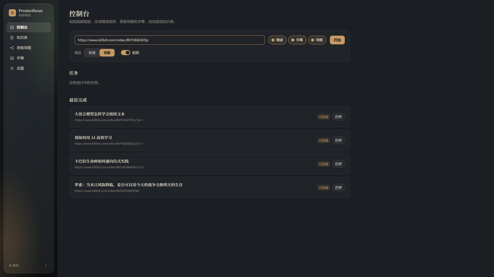
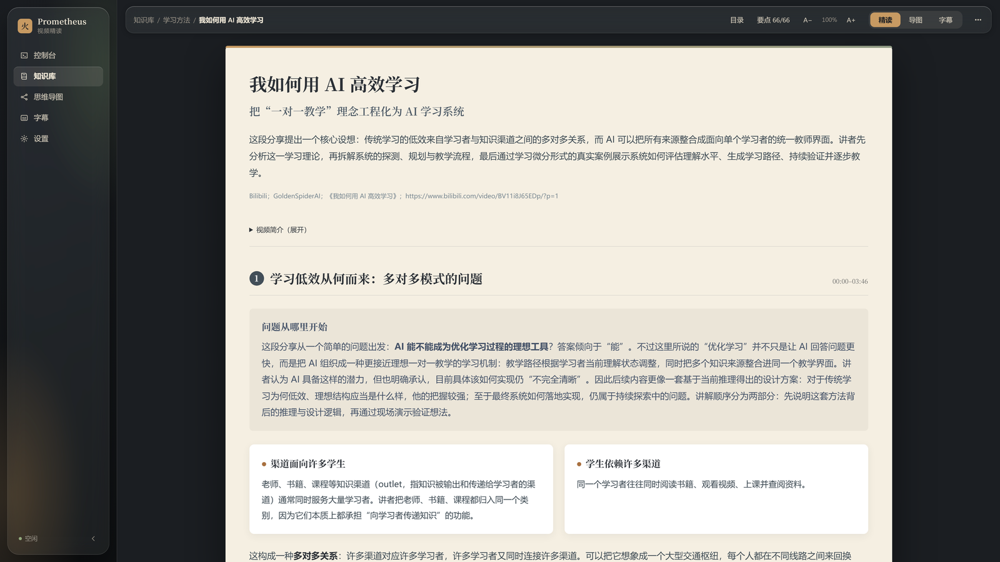
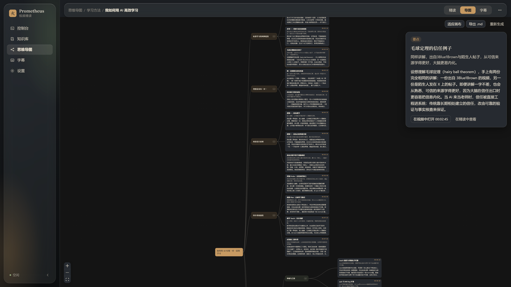
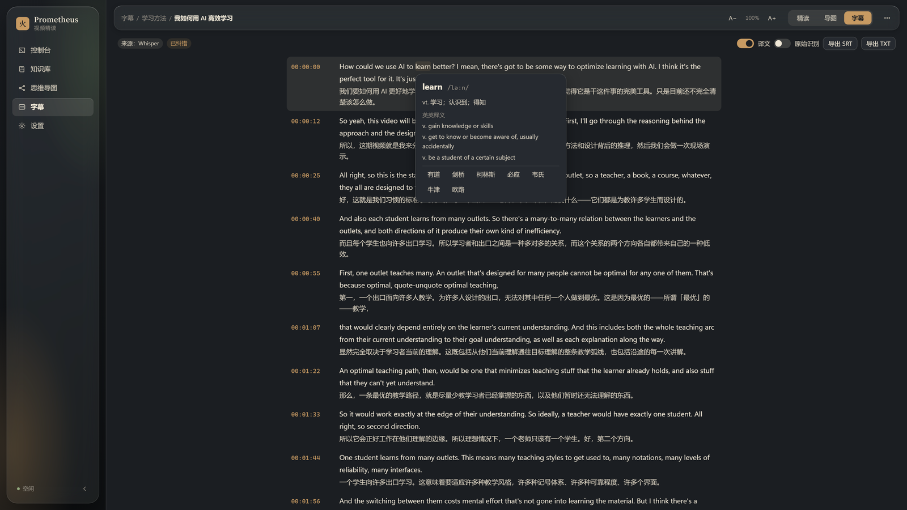
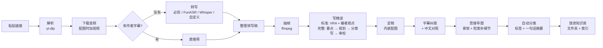

<p align="center"></p>

<h1 align="center">Prometheus</h1>

<p align="center"><b>把 B 站、YouTube 视频变成能长期查阅的个人知识库。</b></p>

<p align="center">
  <a href="https://github.com/HAMBURGER31522/Prometheus/releases/latest">下载安装包</a> ·
  <a href="#上手五步">上手五步</a> ·
  <a href="#接入模型">接入模型</a> ·
  <a href="#整条流程">整条流程</a> ·
  <a href="#常见问题">常见问题</a>
</p>

Windows 桌面软件。粘贴一个视频链接，得到一篇带配图的**精读报告**、一张能跳回视频时刻的**思维导图**、一份纠过错的**字幕**，按分类自动放进你自己电脑上的一个普通文件夹。文件夹同时为人和 AI 准备了两套读法（见[知识库：PDC 式存储](#知识库pdc-式存储)），以后可以直接交给别的 AI 去读、去问。



| 精读 | 思维导图 | 字幕 |
|---|---|---|
|  |  |  |

## 目录

- [能做什么](#能做什么)
- [下载与安装](#下载与安装)
- [上手五步](#上手五步)
- [接入模型](#接入模型)（Pi / Codex CLI / Claude Code，地址要不要带 `/v1`）
- [整条流程](#整条流程)
- [技术栈](#技术栈)
- [转写：为什么这样选](#转写为什么这样选)
- [精读：标准和完整](#精读标准和完整)
- [思维导图](#思维导图)
- [字幕](#字幕)
- [知识库：PDC 式存储](#知识库pdc-式存储)
- [用时与费用参考](#用时与费用参考)
- [常见问题](#常见问题)
- [隐私与安全](#隐私与安全)
- [从源码构建](#从源码构建)
- [致谢与授权](#致谢与授权)

## 能做什么

- **三样东西，按需要选**：链接框右边三个圆圈——「精读」「字幕」「导图」。导图从精读生成，勾导图会带上精读；只要字幕时几分钟就好。没选的部分以后在阅读页点「现在生成」补上，不用重新下载和转写。
- **两种精读详细程度**：「标准」快，适合先过一遍；「完整」慢，但视频里每个有内容的点都会讲透（见[精读：标准和完整](#精读标准和完整)）。
- **转写多条路**：YouTube 有作者上传的字幕就直接用；否则走云端（必剪，免费、不用配置）、本地（中文 FunASR，其他语言 Whisper），或者你自己的 OpenAI 兼容转写接口；云端不可用时自动改用本地。
- **字幕纠错与中外对照**：大模型参考精读改同音错字、补全标点；外语视频每句下面一行中文，英文单词悬停查词（离线词典）。
- **知识库就是一个文件夹**：`<分类>\<日期 标题>\精读.html · 精读.md · 思维导图.md · 字幕.srt · 字幕.txt · 来源.url`，双击就能看，根目录的 `llms.txt`、`index.json` 让 AI 一层层读下去。
- **模型自己选**：DeepSeek、智谱、Kimi、通义千问、MiniMax、豆包、硅基流动、OpenRouter、Anthropic、OpenAI，或者任何 OpenAI / Anthropic 协议的接口（含中转）；也可以用 ChatGPT 账号登录（Codex CLI 官方登录，走订阅额度）。干活的 Agent 可选 Pi、Codex CLI、Claude Code。

## 下载与安装

1. 到 [Releases](https://github.com/HAMBURGER31522/Prometheus/releases/latest) 下载 `Prometheus_1.0.0_x64-setup.exe`（约 191 MB）。
2. 双击安装。装在当前用户下，**不需要管理员权限**。
3. 第一次打开时选一个文件夹放知识库（推荐 `文档\Prometheus 知识库`），以后可以在「设置 → 数据目录」里换。

**需要准备什么**

| 项目 | 说明 |
|---|---|
| 系统 | Windows 10 / 11，64 位。界面用系统的 WebView2：Windows 11 自带；Windows 10 没有时安装程序会自动下载 |
| 大模型 | 一个 API Key（上面任一平台或中转），或者一个 ChatGPT 账号（Codex CLI 官方登录） |
| 显卡（可选） | 有 NVIDIA 显卡时，本地 Whisper 用 CUDA 加速；没有也能跑（Whisper 改用 CPU，中文本来就走只用 CPU 的 FunASR） |
| 磁盘 | 软件装好约 0.8 GB；装上 Codex CLI 或 Claude Code 各多约 0.3–0.5 GB；选本地转写时第一次会下载约 4.6 GB（CUDA 运行库 1.8 GB、Whisper 模型 1.6 GB、FunASR 中文模型 1.2 GB），只用云端转写就不用；每个视频处理完只占约 2–3 MB |

**不需要另外安装的**：Python、Node.js、npm、ffmpeg、yt-dlp、Pi 都已经在安装包里。Codex CLI 和 Claude Code 体积太大（各 200–300 MB）没有放进安装包，第一次在设置里选用时点「安装」，软件会用自带的 npm 装到它自己的目录里（不碰你电脑上已经装的那份）。

> 安装包没有代码签名，Windows 可能提示「Windows 已保护你的电脑」：点「更多信息」→「仍要运行」。个别杀毒软件会误报，可以对照 Release 页面上的 SHA256。

## 上手五步

1. **选模型**：设置 → 模型 → 新建一份配置，点平台按钮、填 API Key（或者 Agent 选 Codex CLI →「官方登录」用 ChatGPT 账号）。保存后点「测试当前模型」。细节见[接入模型](#接入模型)。
2. **选转写方式**：设置 → 转写。不想装东西就选「云端（必剪）」；想离线就选「本地」，第一次点「安装」下载模型。
3. **粘贴链接**：控制台里粘贴 B 站或 YouTube 链接，勾上要的「精读 / 字幕 / 导图」，选「标准」或「完整」、要不要配图，点「开始」。
4. **等它跑完**：控制台显示正在第几步、第几章；可以一次排好几个视频，按顺序一个个处理，随时可以取消。
5. **阅读**：知识库 / 思维导图 / 字幕三个页签用同一套分类；点导图节点能跳回视频时刻或精读里对应的章节；少了哪样就在那一页点「现在生成」。

## 接入模型

软件本身不带模型：写精读、纠字幕、做导图、分类都调用你配置的大模型。「设置 → 模型」里可以存多份配置、一键切换。每份配置回答三个问题：**谁来干活（Agent）**、**怎么连上（接口 + Key，或官方登录）**、**用哪个模型**。

### 三种 Agent

写精读是个长任务：Agent 要在一个工作目录里读转写稿和规则、写 HTML、跑 Python 画图算坐标、自己检查再改。所以真正干活的是一个命令行编程 Agent，软件负责准备材料、分派任务、检查结果。纠字幕、做导图、分类这些一问一答也走同一个 Agent，一份配置管全部。

| Agent | 是什么 | 能走的协议 | 从哪来 |
|---|---|---|---|
| **Pi**（默认） | [pi.dev](https://pi.dev/) 的开源编程 Agent，精读写作框架 VRA 原本就是为它写的 | OpenAI 兼容、Anthropic 都行；另外内置 DeepSeek、智谱 | 随安装包 |
| **Codex CLI** | OpenAI 的命令行 Agent | 只走 OpenAI 的 **Responses 接口**（`/responses`）；或者 ChatGPT 账号官方登录 | 第一次选用时在设置里点「安装」 |
| **Claude Code** | Anthropic 的命令行 Agent | 只走 **Anthropic 协议**（`/v1/messages`） | 同上 |

三个都是软件自己的私有副本：配置放在数据目录里，启动时清掉继承来的 `OPENAI_*`、`ANTHROPIC_*`、`CODEX_*`、`CLAUDE*` 环境变量，和你自己装的 Codex、Claude Code、它们的插件互不影响。设置页的「检查更新」可以看三者的版本、一键更新；新版本先装到临时目录，对着本机的假接口跑通一次自检才替换旧版。

### 四种接法

1. **内置平台**（只用 Pi）：DeepSeek、智谱。选平台、填 Key、选模型，不用填地址。
2. **常用平台按钮**：Kimi、通义千问、MiniMax、豆包（火山方舟）、硅基流动、OpenRouter、Anthropic、OpenAI。点一下自动填好官方地址、协议和推荐模型，旁边有「获取 API Key ↗」直达各家的 Key 页面。
3. **自定义**：任何 OpenAI 兼容或 Anthropic 协议的接口，包括各种中转。自己填地址、协议、模型。
4. **官方登录**（只有 Codex CLI）：点「登录 ChatGPT 账户」会打开 OpenAI 的官方登录页，用 ChatGPT 订阅额度，不按 token 计费。凭据只存在这个软件自己的 Codex 里。

### 地址填到哪一层：要不要带 `/v1`

一句话：**OpenAI 兼容的地址写到平台文档给的那一层（通常以 `/v1` 结尾）；Anthropic 协议带不带 `/v1` 都可以。**

| Agent + 协议 | 实际请求的地址 | 你填 | 软件替你做了什么 |
|---|---|---|---|
| Pi + OpenAI 兼容 | 你填的地址 + `/chat/completions` | `https://api.example.com/v1` | 原样使用，只去掉末尾多余的 `/` |
| Codex CLI + OpenAI 兼容 | 你填的地址 + `/responses` | `https://api.example.com/v1` | 原样使用；**接口必须支持 Responses API**，只有 `/chat/completions` 的中转用不了 Codex CLI，换 Pi |
| Pi + Anthropic | 去掉末尾 `/v1` 的地址 + `/v1/messages` | `https://api.example.com` 或 `https://api.example.com/v1` | 末尾的 `/v1` 自动去掉，不会拼成 `/v1/v1/messages` |
| Claude Code + Anthropic | 同上（交给 Claude Code 的 `ANTHROPIC_BASE_URL` 不带 `/v1`） | 同上 | 同上 |
| Pi 内置 DeepSeek / 智谱 | Pi 自带的官方地址 | 不用填 | — |
| Codex CLI 官方登录 | OpenAI 官方 | 不用填 | — |

- **为什么 OpenAI 兼容不自动补 `/v1`**：各家前缀不一样——OpenAI、Kimi、硅基流动是 `/v1`，豆包是 `/api/v3`，通义千问是 `/compatible-mode/v1`，OpenRouter 是 `/api/v1`。替你猜，猜错了反而连不上，所以照平台文档写。
- **一个坑**：「获取模型列表」在 OpenAI 兼容地址不带 `/v1`、第一次 404 时，会再试一次加了 `/v1` 的地址（和 CC Switch 一样），所以**列表取得到不代表地址填对了**。保存后一定点「测试当前模型」，它走的是真实的调用路径。

### 模型那几项

- **模型名**：照平台写的填，或者点「获取模型列表」直接选。
- **模型能看图**：配图要靠模型先看候选截图再挑；模型不支持图片就关掉，这时精读不配图。
- **思考强度**：关 / 低 / 中 / 高 / 超高 / 最高，各 Agent 按自己的档位换算（Claude Code 没有「关」，最低是「低」）。「完整」精读里的读者和判定这类辅助步骤会自动低一档，省时间。
- **高级 → 上下文窗口、最大输出**：按随包 Pi 的模型目录或 [models.dev](https://models.dev/) 预填，模型目录每天自动从 pi.dev 更新一次。**中转的实际上限比官方小时一定要改小**，否则长任务会被拒（`context_length_exceeded`）。Pi 和 Codex CLI 会按这里的窗口提前压缩上下文（Pi 在七成、Codex 在八成），免得撞上限。
- **Claude Code 的 1M 上下文**：模型名写成 `claude-xxx[1m]`，或者只写模型名、在「高级」里把上下文窗口填 1000000，软件会自动加上 `[1m]`。

## 整条流程


```mermaid
flowchart LR
    A[粘贴链接] --> B[解析<br/>yt-dlp]
    B --> C[下载音频<br/>配图时加视频]
    C --> D{有作者字幕?}
    D -- 有 --> F[直接用]
    D -- 没有 --> E[转写<br/>必剪 / FunASR / Whisper / 自定义]
    E --> G[整理转写稿]
    F --> G
    G --> H[抽帧<br/>ffmpeg]
    H --> I[写精读<br/>标准: VRA + 编者观点<br/>完整: 要点 → 规划 → 分章写 → 审校]
    I --> J[定稿<br/>内嵌配图]
    J --> K[字幕纠错<br/>+ 中文对照]
    K --> L[思维导图<br/>骨架 + 检索补细节]
    L --> M[自动分类<br/>标签 + 一句话摘要]
    M --> N[放进知识库<br/>文件夹 + 索引]
```

没勾精读时跳过抽帧到导图这几步；没勾字幕时跳过纠错。每一步都记在条目的 `run.trace.jsonl` 里；失败时控制台写明在哪一步、为什么、怎么办，点「重试」只重做缺的部分。

| 步骤 | 做什么 | 用什么 |
|---|---|---|
| 解析 | 认出 B 站 / YouTube 链接（含 b23.tv 短链、分 P），取标题、UP 主、时长 | [yt-dlp](https://github.com/yt-dlp/yt-dlp)（YouTube 的签名计算交给随包的 Node） |
| 下载 | 只下音频，转成 16 kHz 单声道；开了配图才下视频画面 | yt-dlp + ffmpeg |
| 平台字幕 | YouTube 视频有作者上传的原语言字幕时直接用，跳过转写 | yt-dlp |
| 转写 | 见[转写：为什么这样选](#转写为什么这样选) | 必剪 / FunASR ONNX / faster-whisper / 自定义接口 |
| 整理转写稿 | 转成带时间戳、带编号的「转写单元」，写作和检查都按编号引用 | VRA 的 transcript 模块 |
| 抽帧 | 按画面变化抽候选截图：相邻两张至少隔 20 秒，每小时最多 20 张、总共最多 80 张，太少时每 5 分钟补一张 | ffmpeg |
| 写精读 | 见[精读：标准和完整](#精读标准和完整) | Pi / Codex CLI / Claude Code + VRA 写作 Skill |
| 定稿 | 截图内嵌进 HTML（单个文件就能打开），补上视频简介，检查格式 | VRA finalize |
| 字幕纠错 | 每批约 2500 字，参考精读改错字、补标点；外语同时翻译成中文 | 你配置的模型 |
| 思维导图 | 先写 3–6 个主题的骨架，再按主题检索精读原文，给每个要点写 2–4 句详解 | 你配置的模型 + BM25 检索 |
| 分类 | 看精读（没有精读时看标题和转写开头），优先放进已有分类，同时给 3–5 个标签和一句话摘要 | 你配置的模型 |
| 放进知识库 | 写文件夹、`精读.md`（带 YAML 头）、`index.json`、`llms.txt`、各分类的 `_index.md`；清掉下载的音视频和中间文件 | Python |

## 技术栈

| 层 | 用了什么 | 为什么 |
|---|---|---|
| 桌面外壳 | [Tauri 2](https://tauri.app/)（Rust），dialog / opener 插件 | 用系统自带的 WebView2，安装包比 Electron 小约 100 MB；外壳只管窗口、起停后台、选文件夹 |
| 界面 | React 19 + Vite 8 + TypeScript 7；导图画布 [React Flow](https://reactflow.dev/)（@xyflow/react 12）；长字幕虚拟滚动 TanStack Virtual | 颜色和动效只能来自两份设计令牌文件（`tokens.css`、`motion.css`），有 lint 检查；「液态玻璃」墨夜外壳 + 浅色纸页报告 |
| 后台 | Python 3.12 + FastAPI + uvicorn，SQLite 记条目和任务 | 只监听 127.0.0.1，每次启动换一个随机令牌；一个视频一个视频地排队处理，取消时结束整棵子进程树 |
| 抓取 | yt-dlp（+ 随包 Node 做 YouTube 的 JS 签名）、ffmpeg | 两个平台都覆盖，更新快 |
| 转写 | 必剪（云）、FunASR paraformer-large + fsmn-vad + ct-punc（ONNX int8，CPU）、faster-whisper large-v3-turbo（CUDA / CPU）、自定义接口 | 见下一节的实测与对比 |
| 精读写作 | [video-report-agent（VRA）](https://github.com/imexlovery/video-report-agent)的写作 Skill + 本项目的「完整」流水线 | 见[精读：标准和完整](#精读标准和完整) |
| Agent | Pi（随包）、Codex CLI、Claude Code（首次使用时安装） | 能用工具（画图、算坐标、检查文件）；三者都在 **Windows 低完整性级别**下运行，只能写本次的工作目录和它自己的配置目录 |
| 导图检索 | 字二元组上的 BM25（自己实现，不需要中文分词器） | 给每个要点找原文依据，详解要有依据才算过 |
| 词典 | [ECDICT](https://github.com/skywind3000/ECDICT)，第一次查词时下载约 23 MB，存进 SQLite | 查词不花 token、不联网 |
| 知识库 | 普通文件夹 + `llms.txt` / `index.json` / `_index.md` 分层索引 | 参考 PDC 协议，见[知识库：PDC 式存储](#知识库pdc-式存储) |
| 打包 | NSIS 安装包，随包 Python（含依赖）、Node + npm、Pi、ffmpeg | 装完即用，不依赖开发环境 |
| 测试 | pytest（约 830 个）、Vitest、Playwright 端到端（假流水线后端）、安装版实测脚本 | 开发时一律用假模型，不向真实接口发请求 |

## 转写：为什么这样选

**软件现在的做法**

- **YouTube 有作者字幕** → 直接用（最准，不花时间）。
- **云端** → [必剪](https://bcut.bilibili.cn/)的识别接口：免费、不用配置，中文最准，但几乎不带标点（后面的字幕纠错会补上）。它是非官方接口，失败时自动改用本地。
- **本地** → 先用 Whisper 判断语言：**普通话走 FunASR**（paraformer-large + fsmn-vad + ct-punc，官方 int8 ONNX 版，只用 CPU）；**其他语言走 faster-whisper large-v3-turbo**（有 NVIDIA 显卡用 CUDA，没有用 CPU）。
- **自定义** → 任何 OpenAI 兼容的 `/audio/transcriptions` 接口（大文件在静音处自动切块）。

**选的标准**（按重要程度）：① 中文准、英文也准；② 普通电脑能装能跑：不要求显卡，不为了转写多带几个 GB 的 torch；③ 带时间戳（导图和精读都要跳回视频时刻）；④ 快；⑤ 免费。

### 本项目的实测（2026-09-27，RTX 4060 Laptop 8 GB）

两段 13 分钟的样本：中文是 B 站知识区风格的快语速口播（参考答案是作者的人工字幕），英文是 TED 演讲。

| 引擎 | 中文字错率 | 英文词错率 | 13 分钟音频识别用时 | 显存 | 时间戳 | 标点 | 要装什么 |
|---|---|---|---|---|---|---|---|
| **必剪（云端）** | **5.99%** | 6.18% | 5 秒 | — | 句子 | 几乎没有 | 无 |
| **FunASR paraformer-zh** | 7.46%（ONNX 版 7.97%） | 12.98%（中文模型，不能用于英文） | 7 秒（GPU 版）/ 23.5 秒（ONNX 版，CPU） | 3.6 GB（GPU 版）/ 不用（ONNX 版） | 句子 | 有 | ONNX 版模型约 1.2 GB |
| **faster-whisper large-v3-turbo** | 7.86% | **2.78%** | 20–30 秒 | 1.9 GB | 句段 | 有 | 模型 1.6 GB + CUDA 运行库 1.8 GB |
| Qwen3-ASR-1.7B | 9.10% | 3.50% | 60–78 秒（8 GB 显卡上要先识别再对齐） | 6.9–7.2 GB | 逐字 | 有 | torch 4 GB + 模型 6.2 GB |

中文三者差一两个百分点，在这一段样本的误差范围里；英文 Whisper 明显最好。FunASR 的 ONNX 版替换错误最少（78 个，Whisper 87 个），不用显卡、体积小、快，所以普通话给它；其他语言给 Whisper。

### 其他方案（公开资料，本项目没有实测）

| 方案 | 是什么 | 长处 | 为什么现在不用 |
|---|---|---|---|
| [Qwen3-ASR](https://github.com/QwenLM/Qwen3-ASR) | 阿里通义的识别模型（1.7B / 0.6B，2026-01 开源），30 种语言、22 种方言 | 公开基准上中文很强、方言多；FunASR 官方说「不在乎延迟要最高质量就用它」 | 上面实测过：在快语速口播上没赢 Whisper 和 FunASR；8 GB 显卡满载，6 GB 跑不动；要带 torch，安装体积多约 10 GB |
| [NVIDIA Nemotron 3.5 ASR](https://huggingface.co/nvidia/nemotron-3.5-asr-streaming-0.6b) | 0.6B 流式模型，约 36 种语言 | 延迟极低（100 ms 内出字），适合实时字幕 | NVIDIA 自己把中文放在第二档（Broad-coverage），社区有人报告中文效果差；我们离线处理整段视频，用不上流式；只能跑在 NVIDIA 显卡上 |
| OpenAI Whisper large-v3（原版） | 多语言的标杆 | 英文和多语言准 | 我们用的 large-v3-turbo 编码器相同，解码器从 32 层减到 4 层，快几倍、准确率接近；已经在用它的这一支 |
| [MOSS-Transcribe-Diarize](https://github.com/OpenMOSS/MOSS-Transcribe-Diarize) + [CrispASR](https://github.com/CrispStrobe/CrispASR) | 上海创智学院 OpenMOSS 团队的 0.9B 模型（2026-07 开源，Apache-2.0），一次出转写、说话人区分和时间戳；CrispASR 是 C++ / GGUF 推理，不要 Python | 能分清谁在说（访谈、播客很有用），50+ 语言，GGUF 可以在 CPU 上跑 | 太新：官方推理走 vLLM / transformers（要 CUDA 环境），GGUF 移植是社区版本；会议集上的字错率（AISHELL-4 14.84%）不比专用模型好；软件现在不做说话人区分。**以后要做「谁说的」首选它** |
| [FunASR 工具箱](https://github.com/modelscope/FunASR)里的其他模型 | Fun-ASR-Nano（0.8B，大模型式）、SenseVoice-Small（234M，带情感和音频事件）、paraformer-zh-streaming（实时） | Nano 方言和热词强；SenseVoice 很快 | FunASR 官方推荐「中文会议 / 通话 → paraformer-zh + fsmn-vad + ct-punc + cam++」，前三样正是我们在用的组合（cam++ 是说话人区分，我们不做）；Nano 在 CPU 上只有约 3.6 倍实时，长音频集上准确率和 SenseVoice 相近（8.06% 对 7.81%）；SenseVoice 的强项是情感和音频事件，精读用不上；streaming 是给实时字幕的 |

**为什么说现在这套最合适**：它不是在每一项上都第一，而是在「中文准 + 英文准 + 不要显卡 + 安装小 + 有时间戳 + 免费」这几条同时满足得最好——

| | 中文 | 英文 | 不要显卡 | 安装体积 | 时间戳 | 免费 |
|---|---|---|---|---|---|---|
| 现在：必剪 / FunASR ONNX + Whisper turbo | ✅ 5.99% / 7.97% | ✅ 2.78% | ✅ | 约 1.2 GB（只用中文）/ 4.6 GB（含外语） | ✅ | ✅ |
| 只用 Whisper | 7.86% | ✅ | 能用 CPU，慢 | 3.4 GB | ✅ | ✅ |
| Qwen3-ASR | 9.10%（这段样本） | 3.50% | ❌ 至少 8 GB 显存 | 约 10 GB | ✅ 逐字 | ✅ |
| Nemotron 3.5 | 第二档语言 | 好 | ❌ | — | ✅ | ✅ |
| MOSS + CrispASR | 会议集 14.84% | — | ✅（GGUF） | — | ✅ + 说话人 | ✅ |
| Fun-ASR-Nano | 好、方言强 | 好 | ✅ 但慢 | — | ✅ | ✅ |

**以后可能的改进**：给访谈类视频加上 MOSS 的说话人区分；Fun-ASR-Nano 的 ONNX 版成熟后，可以和现在的 FunASR 共用同一个推理引擎（ONNX Runtime，VRA 本来就带着它），用来提升方言。

## 精读：标准和完整

精读的写作能力来自 **[video-report-agent（VRA）](https://github.com/imexlovery/video-report-agent)**。它是一份给 AI Agent 用的写作 Skill：

- `SKILL.md`：总规则——忠于来源、商业推广要识别并排除、引用要绑定转写编号、什么时候用图表；
- 五种信息结构（Profile）：`mechanism`（机制）、`procedure`（操作）、`evidence`（实证）、`argument`（观点）、`narrative`（叙事）。Agent 读完转写后按「读者最需要理解的关系」选一个主线、最多一个辅线，只读对应的那一两份写法说明，不按题材套模板；
- 阅读模式和报告模板：决定写多深、版式长什么样。

Agent 在一个只放了转写稿、截图和规则的工作目录里读、写 `report.html`、跑 Python 画图、自己检查，最后交出报告。本项目在它外面加了两种详细程度：

| | 标准 | 完整 |
|---|---|---|
| 适合 | 长视频先过一遍、只想知道讲了什么 | 想学懂、要能复述每个点 |
| 怎么写 | VRA 一次写完，要求按「精读」表达、分章、每章写时间范围、不因为视频短就写成短报告；写完后**每章单独跑一次「编者观点」**，最后补上跳转目录 | ① **要点账本**：每 5 分钟一段，列出视频里每个有内容的点 → ② **规划**：每个要点归到哪一章，哪些合理跳过并写明理由 → ③ **同时写 5 章**（被限流时降到 3、再降到 1），每章写完程序检查漏写、空洞、照抄原文、写处理过程，最多退回 2 轮 → ④ **两位零基础读者**追问（为什么、凭什么、举个例子、想看图），判定后改写，补充说明写透「是什么、为什么要紧、一个例子」 → ⑤ 每章一次编者观点 → ⑥ 收尾检查（没画的图、没补的背景、只有一两句的补充、免责句太密） |
| 编者观点 | 有：分点写，每点标置信度（高 / 中 / 低）和依据链接 | 同左 |
| 链接核实 | 程序逐个打开编者观点里的链接，打不开或不相关的删掉，置信度降一档 | 同左 |
| 额外输出 | — | `coverage.json`：要点覆盖了多少、哪些合理跳过，阅读页显示「要点 142/146」 |
| 用时 | 5 分钟视频写精读约 10 分钟（Codex gpt-6.1-sol「高」） | 视频时长的 2–4.5 倍（见[用时与费用参考](#用时与费用参考)） |

两种模式的共同规则：人物说的话只能来自视频，编者自己的判断放进单独的「编者观点」框；正文不写处理过程；配图只用画面里有正文写不出的信息的截图。中间结果（要点账本、规划、每一章）按输入的摘要保存，失败后「重试」只重做缺的部分，不会从头花一遍钱。

「完整」的评测（闭卷问答：只看报告能不能答出视频里的问题；忠实度抽检：随机抽 40 句查有没有依据）在三个视频上都过了门槛：闭卷问答 91–100%，无依据句 ≤ 2/40。

## 思维导图

参考 [BiliSum](https://github.com/lycohana/BiliSum) 的知识树写法，**越往外越具体**：

1. 根节点只写标题；3–6 个一级主题只点题；
2. 模型先写骨架（主题 → 子题 → 要点，每个要点带视频时刻）。程序检查层级、字数、每个要点的时间落不落在某一章、章节覆盖到没到八成，不合格带着问题让它改（最多试 3 次；只剩字数略超这类小问题时照样保存，并记下来）；
3. 再按主题分批，用 BM25 检索精读原文，给每个末端要点写 2–4 句详解；程序逐条检查长度、是不是只是复述摘要、有多少能在原文里找到、有没有具体信息，不过关的退回改一次。

画布上点节点看摘要和详解，「在精读中查看」跳到对应章节，时间戳跳回视频；另存一份 `思维导图.md`，可以导入 XMind、Obsidian。

## 字幕

- 转写结果合并成 10–15 秒一段，方便阅读；原始识别随时可以切回来看；
- 纠错：大模型参考精读（人名、术语更准）改同音错字、补标点，不增删内容，每段起止时间不变；实测字错率 whisper 8.17% → 7.01%、必剪 6.17% → 5.86%（标点从每百字 0.9 个补到 6.3 个）；
- 外语视频：同一次调用给出中文翻译，每句下面一行中文；英文单词悬停查词（ECDICT 离线词典，会还原词形），还能一键打开有道、剑桥、柯林斯、必应、韦氏；
- 导出 SRT / TXT。

## 知识库：PDC 式存储

### 思路

[PDC（Parallel Data Channel，平行数据通道）](https://bsheepcoder.github.io/2026/06/22/pdc-protocol/)是给博客用的一套约定，核心是两句话：

1. **不要指望一个通道同时满足两类读者。** 人要的是排好版、带图、能点的页面；AI 要的是没有噪音的纯文本和结构化的元数据。同一份内容出两条通道：给人 HTML，给 AI Markdown / JSON。
2. **渐进式披露。** AI 先读一份很短的总目录（`llms.txt`），再按需看索引，最后只打开真正要的那一篇。花的 token 一层比一层多，但只在需要时才花。

Prometheus 把这套想法用在本地文件夹上：

```
Prometheus 知识库\
├── 说明.txt                  给人看：这个文件夹里每样东西是什么、怎么备份
├── llms.txt                  第 1 层（给 AI）：总目录，有哪些分类、每类几篇、怎么往下读
├── index.json                第 2 层（给 AI）：全部条目的元数据——标题、分类、标签、一句话摘要、来源、各文件路径
├── 人工智能\                  一个分类一个文件夹
│   ├── _index.md             第 2 层（给 AI）：这个分类的目录，每篇一行：标题、日期、摘要、相对链接
│   └── 2026-09-30 大语言模型怎样学会接续文本\
│       ├── 精读.html          给人：双击用浏览器打开，截图已内嵌，单个文件就完整
│       ├── 精读.md            第 3 层（给 AI）：开头 YAML 写标题、日期、分类、标签、摘要、来源；正文保留标题层级、列表、表格、图注，不含图片数据
│       ├── 思维导图.md        导图大纲，带视频时刻链接，可导入 XMind / Obsidian
│       ├── 字幕.srt           带时间戳的字幕
│       ├── 字幕.txt           字幕纯文本（只要了字幕的条目，AI 读这个）
│       └── 来源.url           双击打开原视频
└── .prometheus\              软件内部数据（隐藏）
```

### 为什么这样做

- **人和 AI 各取所需**：精读.html 里内嵌的截图是 base64，一张图就是几十万字符；给 AI 读的 精读.md 不带这些，一篇几千到几万字，干净、省 token。
- **AI 不用把整个库读一遍**：问「我看过的视频里谁讲过分税制」，AI 先看 `llms.txt`（几百字）知道有哪些分类，再看 `index.json` 或某个分类的 `_index.md` 里的标签和摘要，挑出一两篇再打开 精读.md。库里有一百篇也只读需要的那几篇。
- **元数据是强约定**：每篇 精读.md 的开头都是同一套 YAML 字段，`index.json` 的字段也固定，AI 和脚本都能直接用，不用猜。
- **永远是最新的**：每次条目完成、改名、移动、删除，都会重写 `llms.txt`、`index.json` 和受影响分类的 `_index.md`。

### 和原版 PDC 不一样的地方

- 原版在博客构建时从 Markdown 源文件分出两条通道（「平行，而不是转换」）；这里没有 Markdown 源文件——Agent 写出来的就是 HTML，所以 精读.md 是**从 HTML 转出来的**，转换时只保留结构和文字。
- 原版要求接口路径全是 ASCII；这里是给人双击打开的本地文件夹，所以用中文的分类名和「日期 标题」命名，看名字就知道是哪个视频。
- 多了 `说明.txt`（给人的说明书）和隐藏的 `.prometheus\`（数据库、设置、模型、缓存，人不用碰）。

### 其他

- 只生成了部分内容的条目，文件夹里只有生成了的文件；没有精读时用视频标题命名，补上精读后改用精读标题。
- 在软件里改分类名、移动、删除条目，文件夹会同步；手动挪动了文件夹，软件会提示「文件缺失」并给出「删除记录」「重新生成」。
- 任务完成后自动清理下载的音视频和中间文件（一个 104 分钟的视频，中间文件 391 MB，清理后只剩约 2.5 MB）。
- `.prometheus\` 里是数据库、设置（含 API Key）、转写模型、CUDA 运行库、离线词典、Agent 的配置和日志。备份时连它一起拷；换电脑后在设置里选这个文件夹就能接着用。

## 用时与费用参考

**整条流水线**（下载 → 放进知识库）：

| 视频 | 选了什么 | 模型 | 用时 |
|---|---|---|---|
| 5 分钟（安装版实测） | 三样、标准、配图 | Codex gpt-6.1-sol「高」（官方登录） | 16.7 分钟（写精读 10.4 分钟） |
| 13 分钟 | 只要字幕 | Codex gpt-6-luna「超高」 | 6.4 分钟 |
| 13 分钟 | 精读 + 导图、标准 | Codex gpt-6-luna「超高」 | 16.8 分钟 |
| 8 分钟 | 三样、完整、配图 | Codex CLI + 中转 gpt-6-astra「超高」 | 38.5 分钟 |
| 8 分钟 | 三样、完整、配图 | Claude Code + 中转 claude-opus-4-8「中」 | 25 分钟 |

**「完整」精读**（开配图，只算要点、规划、写作三步；测于 2026-09-29，之后流程又调整过，看量级即可）：

| 视频 | 模型与思考强度 | 合计 | 约为视频时长的 |
|---|---|---|---|
| 英文 19 分钟 | gpt-6-luna「最高」 | 85 分钟 | 4.5 倍 |
| 英文 19 分钟 | gpt-6-luna「超高」 | 54 分钟 | 2.8 倍 |
| 104 分钟 | gpt-6-luna「超高」 | 约 4 小时 | 2.3 倍 |
| 英文 19 分钟 | claude-opus-4-8「中」 | 37 分钟 | 1.9 倍 |
| 8 分钟 | claude-opus-4-8「中」 | 22 分钟 | 2.7 倍 |

**token 和费用**：同一个视频，不同模型的输入在同一数量级（英文 19 分钟「完整」约 400–560 万 token），差别主要在输出（思考内容算输出，GPT「最高」约是 Claude「中」的 2.5–4 倍）。**费用主要看接口有没有提示缓存**：Agent 每一轮都会把之前的上下文重新发一遍，同样约 400 万输入，全部未缓存时这部分约 20 美元，九成命中缓存时约 4 美元（按 claude-opus-4-8 官方价折算）。用 ChatGPT 账号（Codex 官方登录）走订阅额度，不按 token 计费。省钱的办法：先用「标准」；选有提示缓存的接口；不需要的视频只要字幕。

## 常见问题

- **SmartScreen 拦截**：安装包没有签名，点「更多信息」→「仍要运行」。
- **精读很慢**：先用「标准」；「完整」适合想学懂的视频。一个视频可以先只要字幕，之后在阅读页点「现在生成」。
- **中转站超时 / 限流**：会自动重试（10 秒起翻倍，最长等 2 分钟，最多 10 次），同时写的章数会自动从 5 降到 3、再到 1。
- **连不上 / 404**：多半是地址层级不对，看[地址填到哪一层](#地址填到哪一层要不要带-v1)；用 Codex CLI 时确认接口支持 Responses API。
- **失败了怎么办**：控制台写明在哪一步失败、原因和怎么办，「详情」里有原始报错可以复制；点「重试」只会重做缺的部分。
- **B 站 412**：B 站风控，稍等再试，或在设置里填代理。
- **YouTube 要求登录**：在设置里填 cookies.txt 的路径。
- **卸载**：「设置 → 应用 → 安装的应用」里卸载 Prometheus。**卸载不会删除知识库文件夹**；想彻底删掉，卸载后手动删它。
- **后台日志**：`%APPDATA%\com.hamburger31522.prometheus\backend.log`（每次启动覆盖）；每个条目的每一步记在 `.prometheus\cache\<条目ID>\run.trace.jsonl`。报问题时请附上它们（先删掉里面可能有的私人内容）。

## 隐私与安全

- 视频、转写、精读、导图、字幕都只存在你的电脑上；只有你配置的大模型接口（和你选的云端转写）会收到内容。
- API Key 只保存在本机数据目录的设置文件里（明文，和 VRA 的 `.env` 做法一致），界面上只显示掩码。
- 后台只监听 127.0.0.1，每次启动生成随机令牌，别的程序和网页调不了它。
- 写作 Agent 在 Windows 低完整性级别下运行，只能写本次的工作目录和它自己的配置目录，删不掉、改不了你的其他文件；也读不到你自己装的 Codex、Claude Code 的配置。

## 从源码构建

```
app/                桌面端
  src/features/     按功能分：console（控制台）、report（精读）、mindmap（导图）、subtitle（字幕）、settings（设置）
  src/shared/       几个页面共用的：侧栏、阅读页框架、接口、设计令牌
  src-tauri/        Tauri 外壳（Rust）
  e2e/              Playwright 端到端测试
  scripts/          假流水线后端、设计令牌 lint、截图（screenshots/）、安装版实测驱动（acceptance/）
backend/
  src/prometheus/   Python 后台，按功能分：ingest（链接与下载）、transcribe、report、figures、mindmap、subtitle、
                    library（知识库）、tasks（队列与流水线）、agents（三个 Agent 与隔离）、llm、settings、api
  tests/            和 src 一一对应的子目录；fixtures/ 是假流水线用的样本
vendor/             video-report-agent（git subtree，保留上游历史）
scripts/            打包（package.ps1）、安装版实测（acceptance/）、转写 / 精读 / 导图评测
```

需要 Python 3.12（用 [uv](https://docs.astral.sh/uv/) 管理）、Node 22、Rust（Tauri 2）、ffmpeg。

```
uv sync
uv run pytest backend/tests -q -m "not live"     # 不花钱：全部用假模型
npm --prefix app ci
npm --prefix app run test
npm --prefix app run e2e                          # 自动起假流水线后端和 Vite
powershell -File scripts\package.ps1              # 打包成 NSIS 安装包
```

## 致谢与授权

- 精读写作来自 [imexlovery/video-report-agent](https://github.com/imexlovery/video-report-agent)（以 git subtree 放在 `vendor/`，保留原始提交历史）；VRA 作者同意本项目二次开发并按 MIT 发布。
- 导图的知识树写法、平台字幕优先的做法参考了 [BiliSum](https://github.com/lycohana/BiliSum)（只参考，没有引入代码）。
- 知识库的两条通道和分层索引参考了 [PDC 协议](https://bsheepcoder.github.io/2026/06/22/pdc-protocol/)。
- 转写用到 [FunASR](https://github.com/modelscope/FunASR)、[faster-whisper](https://github.com/SYSTRAN/faster-whisper)；下载用 [yt-dlp](https://github.com/yt-dlp/yt-dlp)；查词用 [ECDICT](https://github.com/skywind3000/ECDICT)；Agent 用 [Pi](https://pi.dev/)。
- 图标的火焰来自 [Phosphor Icons](https://github.com/phosphor-icons/core)（MIT）。

本项目以 [MIT License](LICENSE) 发布。
