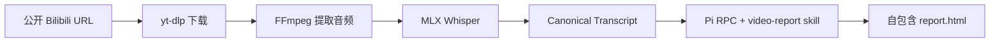

# Video Report Agent

[English](README.md) | 简体中文

在 Apple Silicon macOS 上，把公开视频转换为可直接打开的 HTML 精读报告。

> `Bilibili URL → yt-dlp → FFmpeg → MLX Whisper → Canonical Transcript → Pi RPC → report.html`

## 项目概览

| | 当前行为 |
| --- | --- |
| 输入 | 公开的 HTTPS Bilibili 视频链接或完整 BV 号。多 P 视频可用 `?p=2` 选择分 P。 |
| 默认路径 | 使用 ASR 生成文字稿，关闭 OCR。 |
| 可选路径 | 发现或导入字幕，再进行保守的本地 OCR 与 Fusion。 |
| 输出 | 带时间戳的文字稿、来源溯源产物和自包含的 `report.html`。 |
| 运行方式 | 本地工具；一个 worker 按顺序处理 run。 |
| 报告模型 | Pi RPC 使用 `.env` 或 Web UI 选择的 Provider 和模型。 |

## 快速开始

### 环境要求

- Apple Silicon macOS。默认 ASR 后端使用 MLX Whisper。
- Python 3.12。
- `ffmpeg` 和 `ffprobe` 已加入 `PATH`。
- Pi 0.85.0 已加入 `PATH`。
- 已配置模型 Provider 和凭证。示例环境默认使用 DeepSeek。

### 安装与配置

```sh
uv sync
cp .env.example .env
```

在 `.env` 中设置 Provider、模型和凭证：

```dotenv
PI_PROVIDER=deepseek
PI_MODEL=deepseek-v4-flash-vision-exp
PI_API_KEY=your-api-key
```

如果选定的 Provider 已经通过项目级 Pi 目录登录，可以将 `PI_API_KEY` 留空。交互式登录命令如下：

```sh
PI_CODING_AGENT_DIR="$PWD/config/pi" pi
# 在 Pi 内执行 /login。
```

### 启动 Web UI

```sh
uv run video-report web --port 8765
```

打开 [http://127.0.0.1:8765](http://127.0.0.1:8765)，粘贴公开 Bilibili 链接或 BV 号，然后点击 **生成 Visual Report**。UI 会显示处理进度，可以选择报告模型，也会保留已完成报告的历史记录。

### 使用 CLI

```sh
uv run video-report generate \
  'https://www.bilibili.com/video/BV...' \
  --transcript-mode asr-only
```

命令会以 JSON 打印 run 状态。报告保存在 `runs/<run-id>/report.html`。

如果要使用其他 run 根目录，需要把全局参数放在子命令之前：

```sh
uv run video-report --runs /path/to/runs generate 'https://www.bilibili.com/video/BV...'
```

首次运行时可能会下载 `mlx-community/whisper-large-v3-turbo` 模型。

## 文字稿模式

Canonical Transcript 是媒体处理和报告生成之间的边界。无论选择哪种模式，Pi 都会读取同一份 `transcript.md` 投影。

| 模式 | 做什么 | 适用场景 |
| --- | --- | --- |
| `asr-only` | 使用 MLX Whisper 生成文字稿。关闭 OCR，也不查找字幕。 | 默认路径、快速生成和基线检查。 |
| `fused` | 以 ASR 作为时间线锚点，再按配置发现字幕、导入本地字幕、采样本地 OCR，并记录来源溯源。可选来源失败时会保留警告。 | 画面字幕或已有字幕轨道可以帮助修正文字稿时。 |

下面的 CLI 示例显式启用 Fusion：

```sh
# 查找字幕，并自动检测稳定的 OCR 区域。
uv run video-report generate 'https://www.bilibili.com/video/BV...' \
  --transcript-mode fused \
  --ocr-mode auto

# 已知字幕区域时，使用归一化的 x1,y1,x2,y2 坐标。
uv run video-report generate 'https://www.bilibili.com/video/BV...' \
  --transcript-mode fused \
  --ocr-mode roi \
  --ocr-roi 0.05,0.72,0.95,0.98

# 导入本地 SRT、VTT 或 ASS 字幕文件。
uv run video-report generate 'https://www.bilibili.com/video/BV...' \
  --transcript-mode fused \
  --subtitle-file ./captions.srt
```

OCR 模式包括：

- `off`：关闭 OCR，默认值。
- `auto`：检测稳定的字幕区域；区域不稳定时自动降级。
- `roi`：使用显式的 `--ocr-roi` 矩形。CLI 也接受 `on` 作为 `roi` 的别名。

Web UI 的 **高级设置** 提供相同的文字稿、OCR 和字幕选项。只有选择 `fused` 时才会使用 OCR。可选增强依赖通过下面的命令安装：

```sh
uv sync --extra enhancement
```

## 流程如何工作



每个 run 都有自己的工作目录，位置是 `runs/<run-id>/`。适配器会把报告 skill 和相关 assets 复制到该目录，以 `--mode rpc` 启动 Pi，并让 Pi 读取当前 run 的文字稿。它会等待 `agent_settled`，确认最终 assistant 正常停止，再检查 `report.html` 是否为完整 HTML 文档。

Pi 负责 Agent 循环、工具执行、重试和上下文压缩。这个产品没有额外加入 planner、critic、修订工作流或多 Agent 编排；生成流程也没有浏览器硬门禁。

## Run 产物

一次成功 run 的重要文件大致如下：

```text
runs/<run-id>/
├── input.json
├── status.json
├── download/
│   ├── source.<ext>
│   └── source.info.json
├── audio.wav
├── asr.json
├── transcript.md
├── canonical-transcript.jsonl
├── transcript-manifest.json
├── SKILL.md
├── assets/
├── sessions/
├── invocation.json
├── pi.events.jsonl
├── pi.stderr.log
└── report.html
```

Fusion run 还可能包含下载或导入的字幕、`subtitle-ocr-events.jsonl`、OCR 帧候选和其他诊断文件。失败的 run 会保留已有文件，并增加 `failure.log`；系统不会静默地用成功结果替换失败记录。

## 模型与项目级 Pi 配置

- CLI 从项目根目录加载 `.env`。进程中已经存在的环境变量优先。
- `PI_PROVIDER`、`PI_MODEL` 和 `PI_API_KEY` 决定报告模型。Web UI 可以选择已配置的 Pi 模型，也可以保存自定义的 OpenAI 兼容 Provider。
- `config/pi/models.json` 是纳入版本控制的项目配置。凭证和 Pi 运行状态不会进入 Git。
- 生成报告时，程序始终把 `PI_CODING_AGENT_DIR` 设置为项目的 `config/pi/` 目录，避免意外加载用户目录中的 Pi 凭证、模型和设置。
- 项目级 Pi 可执行程序仍需单独安装。`uv sync` 不会安装 Pi。

## 存储与媒体清理

Web 服务启动时和每次生成结束后都会执行清理。清理只针对成功 run 中下载的 MP4 文件和 `audio.wav`。

| 变量 | 默认值 | 含义 |
| --- | ---: | --- |
| `MEDIA_KEEP_LAST` | `20` | 保留最近 20 条成功 run 的媒体文件。 |
| `MEDIA_MAX_AGE_DAYS` | `0` | 关闭按时间清理；设为正数后会清理更早的媒体。 |

将任一限制设为 `0` 可以关闭该限制。两项同时启用时，只要任一条件到期就会清理媒体。报告、文字稿、字幕、元数据、assets 和日志都会保留。失败及进行中的 run 不会清理；服务停止期间也不会定时清理。

## 本地工具边界

- 输入只接受公开的 HTTPS Bilibili 视频，不实现登录或私有视频访问。
- 默认转写路径要求 Apple Silicon macOS。Linux 部署需要替换转写后端。
- 下载、音频提取和 ASR 在本机完成。报告生成需要把选定的数据交给模型 Provider，请根据来源内容选择合适的 Provider。
- Pi 在 run 目录内使用标准的 `read`、`write`、`edit` 和 `bash` 工具。系统指令会限制预期工作范围，但这些工具不是操作系统级沙箱，技术上仍保留宿主机访问能力。
- Web 服务重启时，未完成的 run 会标记为失败；已完成报告仍保留在 run 根目录中。
- 生成的 HTML 通过带 sandbox CSP 的方式提供服务。当前应用不宣称具备部署级隔离能力。

## 开发检查

```sh
uv run --extra enhancement pytest -q
uv run ruff check src tests
uv lock --check
```

报告写作行为由 [`src/video_report_agent/skills/video-report/SKILL.md`](src/video_report_agent/skills/video-report/SKILL.md) 定义。
