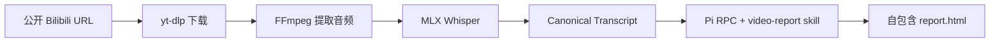

# Video Report Agent

[English](README.md) | 简体中文

在 Apple Silicon macOS 上，把公开视频转换为可直接打开的 HTML 精读报告。

Windows 使用 Docker Linux + Paraformer + Cloudflare Tunnel，详见 [部署说明](DEPLOYMENT.md)。

> `Bilibili URL → yt-dlp → FFmpeg → MLX Whisper → Canonical Transcript → Pi RPC → report.html`

## 项目概览

| | 当前行为 |
| --- | --- |
| 输入 | 公开的 HTTPS Bilibili 视频链接或完整 BV 号。多 P 视频可用 `?p=2` 选择分 P。 |
| 默认路径 | 使用 ASR 生成文字稿，关闭 OCR。 |
| 可选路径 | 发现或导入字幕，再进行保守的本地 OCR 与 Fusion。 |
| 输出 | 带时间戳的文字稿、来源溯源产物和自包含的 `report.html`。 |
| 运行方式 | 单服务器文件队列；默认并发 1，每个 owner 同时最多执行 1 个任务。 |
| 报告模型 | Pi RPC 使用 `.env` 或 Web UI 选择的 Provider 和模型。 |

## 快速开始

### 环境要求

- Apple Silicon macOS。默认 ASR 后端使用 MLX Whisper。
- Python 3.12。
- `ffmpeg` 和 `ffprobe` 已加入 `PATH`。
- Pi 0.85.0 已加入 `PATH`。
- 已配置模型 Provider 和凭证。示例环境默认使用 DeepSeek。


报告同时输出 `report.png`：使用本地 Chromium 按 920 像素桌面宽度截取完整页面，保留 860 像素白色报告页面及两侧少量灰色背景，不增加模型调用。主页面和历史记录均提供“查看图片”；旧报告首次查看时补生成长图。

### 安装与配置

```sh
uv sync --extra mlx
uv run playwright install chromium
cp .env.example .env
```

在 `.env` 中设置 Provider、模型和凭证：

```dotenv
PI_PROVIDER=deepseek
PI_MODEL=deepseek-flash
PI_API_KEY=your-api-key
```

如果选定的 Provider 已经通过项目级 Pi 目录登录，可以将 `PI_API_KEY` 留空。交互式登录命令如下：

```sh
PI_CODING_AGENT_DIR="$PWD/config/pi" pi
# 在 Pi 内执行 /login。
```

### 启动 Web UI

```sh
uv run video-report web --port 8765
```

打开 [http://127.0.0.1:8765](http://127.0.0.1:8765)，粘贴公开 Bilibili 链接或 BV 号，然后点击 **生成 Visual Report**。UI 会显示处理进度，可以选择报告模型，也会保留已完成报告的历史记录。

### V1 多用户队列

默认 `--mode local` 保留模型选择、配置和连接测试。Public 模式隐藏并禁止这些接口，
任务统一使用服务器模型配置：

```sh
uv run video-report web --mode public --port 8765 \
  --max-concurrency 1 --max-active-per-owner 2 --max-queue-length 20
```

默认监听 `127.0.0.1`；需要改变监听地址时使用 `--host`。在 HTTPS 反向代理后运行时，
传入 `--public-origin https://你的域名`（不带末尾斜杠），用于 Origin 检查和 Secure cookie。
这些参数是运行配置，命令不会配置代理或部署服务。

单个视频最长 3 小时（含 3 小时），无法确认时长时拒绝处理；历史下载复用也检查时长。
Web 和 CLI 任务从开始执行起最多运行 30 分钟，排队不计时；超时停止本地任务进程组并标记失败。
已提交的云端 ASR 不会因此自动取消，可能继续执行和计费。
Public 后端仅允许 ASR，拒绝 OCR、融合及字幕导入，包括重启恢复的旧排队任务；Local 保留这些功能。

- 文件 FIFO 队列先选择最早可执行的任务；同一 owner 已有任务运行时，暂时跳过其等待任务。
  等待位置表示队列顺序，不保证并发任务的完成顺序。
- 每个 owner 默认最多 2 个等待加运行任务，且固定最多 1 个运行任务；全局最多 20 个等待任务。
  超限返回 `429`，页面显示原因。提高并发前需实测机器资源。
- 服务端签发的持久 cookie 标识 owner；“我的任务”、状态、报告及 assets 按 owner 隔离。
  清除 cookie 会失去原任务访问身份，也可以绕过 session 级上限；全局上限仍有效。
- `runs/.session-key` 应与 runs 一起保留；不要公开或删除，否则原 cookie 无法验证。
  同一个 runs 根目录只允许一个 Web 调度器，第二个实例会拒绝启动。
- 每个 Web run 的 `queue.json` 持久化 owner、顺序和调度状态；`status.json` 保留执行阶段。
  重启只恢复 `QUEUED`，不自动重跑中断的 `RUNNING`。没有队列记录的旧任务不自动执行，
  仅在 Local 模式保留历史访问。CLI 直接生成不经过 Web 队列与准入限制。
- 正常关闭停止领取等待任务，并等待已运行任务结束；未领取任务下次启动继续排队。
- Paraformer 取得 task ID 后立即写入 `asr-task.json`；已有 ID 时拒绝重新提交，
  本版不恢复云端轮询。云端已接收但 ID 尚未落盘的中断窗口仍存在。

本版不包含阶段 checkpoint、RUNNING 自动恢复、账户计费或 OS 级多租户隔离。

### 使用 CLI

```sh
uv run video-report generate \
  'https://www.bilibili.com/video/BV...' \
  --transcript-mode asr-only
```

命令会以 JSON 打印 run 状态。报告保存在 `runs/<run-id>/report.html`。

如果要使用其他 run 根目录，需要把全局参数放在子命令之前：

```sh
uv run video-report --runs /path/to/runs generate 'https://www.bilibili.com/video/BV...'
```

首次运行时可能会下载 `mlx-community/whisper-large-v3-turbo` 模型。

## 文字稿模式

Canonical Transcript 是媒体处理和报告生成之间的边界。无论选择哪种模式，Pi 都会读取同一份 `transcript.md` 投影。

| 模式 | 做什么 | 适用场景 |
| --- | --- | --- |
| `asr-only` | 使用 MLX Whisper 生成文字稿。关闭 OCR，也不查找字幕。 | 默认路径、快速生成和基线检查。 |
| `fused` | 以 ASR 作为时间线锚点，再按配置发现字幕、导入本地字幕、采样本地 OCR，并记录来源溯源。可选来源失败时会保留警告。 | 画面字幕或已有字幕轨道可以帮助修正文字稿时。 |

下面的 CLI 示例显式启用 Fusion：

```sh
# 查找字幕，并自动检测稳定的 OCR 区域。
uv run video-report generate 'https://www.bilibili.com/video/BV...' \
  --transcript-mode fused \
  --ocr-mode auto

# 已知字幕区域时，使用归一化的 x1,y1,x2,y2 坐标。
uv run video-report generate 'https://www.bilibili.com/video/BV...' \
  --transcript-mode fused \
  --ocr-mode roi \
  --ocr-roi 0.05,0.72,0.95,0.98

# 导入本地 SRT、VTT 或 ASS 字幕文件。
uv run video-report generate 'https://www.bilibili.com/video/BV...' \
  --transcript-mode fused \
  --subtitle-file ./captions.srt
```

OCR 模式包括：

- `off`：关闭 OCR，默认值。
- `auto`：检测稳定的字幕区域；区域不稳定时自动降级。
- `roi`：使用显式的 `--ocr-roi` 矩形。CLI 也接受 `on` 作为 `roi` 的别名。

Web UI 的 **高级设置** 提供相同的文字稿、OCR 和字幕选项。只有选择 `fused` 时才会使用 OCR。可选增强依赖通过下面的命令安装：

```sh
uv sync --extra mlx --extra enhancement
```

## 流程如何工作



每个 run 都有自己的工作目录，位置是 `runs/<run-id>/`。适配器会把报告 skill 和相关 assets 复制到该目录，以 `--mode rpc` 启动 Pi，并让 Pi 读取当前 run 的文字稿。它会等待 `agent_settled`，确认最终 assistant 正常停止，再检查 `report.html` 是否为完整 HTML 文档。

Pi 负责 Agent 循环、工具执行、重试和上下文压缩。这个产品没有额外加入 planner、critic、修订工作流或多 Agent 编排；生成流程也没有浏览器硬门禁。

## Run 产物

一次成功 run 的重要文件大致如下：

```text
runs/<run-id>/
├── input.json
├── status.json
├── download/
│   ├── source.<ext>
│   └── source.info.json
├── audio.wav
├── asr.json
├── transcript.md
├── canonical-transcript.jsonl
├── transcript-manifest.json
├── SKILL.md
├── assets/
├── sessions/
├── invocation.json
├── pi.events.jsonl
├── pi.stderr.log
└── report.html
```

Fusion run 还可能包含下载或导入的字幕、`subtitle-ocr-events.jsonl`、OCR 帧候选和其他诊断文件。失败的 run 会保留已有文件，并增加 `failure.log`；系统不会静默地用成功结果替换失败记录。

## 模型与项目级 Pi 配置

- CLI 从项目根目录加载 `.env`。进程中已经存在的环境变量优先。
- `PI_PROVIDER`、`PI_MODEL` 和 `PI_API_KEY` 决定报告模型。Web UI 可以选择已配置的 Pi 模型，也可以保存自定义的 OpenAI 兼容 Provider。
- `config/pi/models.json` 是纳入版本控制的项目配置。凭证和 Pi 运行状态不会进入 Git。
- 生成报告时，程序始终把 `PI_CODING_AGENT_DIR` 设置为项目的 `config/pi/` 目录，避免意外加载用户目录中的 Pi 凭证、模型和设置。
- 项目级 Pi 可执行程序仍需单独安装。`uv sync` 不会安装 Pi。

## 存储与媒体清理

Web 服务启动时和每次生成结束后都会执行清理。清理只针对成功 run 中下载的 MP4 文件和 `audio.wav`。

| 变量 | 默认值 | 含义 |
| --- | ---: | --- |
| `MEDIA_KEEP_LAST` | `20` | 保留最近 20 条成功 run 的媒体文件。 |
| `MEDIA_MAX_AGE_DAYS` | `0` | 关闭按时间清理；设为正数后会清理更早的媒体。 |

将任一限制设为 `0` 可以关闭该限制。两项同时启用时，只要任一条件到期就会清理媒体。报告、文字稿、字幕、元数据、assets 和日志都会保留。失败及进行中的 run 不会清理；服务停止期间也不会定时清理。

## 本地工具边界

- 输入只接受公开的 HTTPS Bilibili 视频，不实现登录或私有视频访问。
- 默认转写路径要求 Apple Silicon macOS。Paraformer 路径不依赖 MLX；Linux 部署本身尚未验收。
- 下载、音频提取和 ASR 在本机完成。报告生成需要把选定的数据交给模型 Provider，请根据来源内容选择合适的 Provider。
- Pi 在 run 目录内使用标准的 `read`、`write`、`edit` 和 `bash` 工具。系统指令会限制预期工作范围，但这些工具不是操作系统级沙箱，技术上仍保留宿主机访问能力。
- Web 重启恢复已入队的 `QUEUED` 任务；中断的 `RUNNING` 任务标记为 `FAILED / SERVER_INTERRUPTED`，不自动重跑。终态任务保持不动。
- 生成的 HTML 通过带 sandbox CSP 的方式提供服务。当前应用不宣称具备部署级隔离能力。

## 开发检查

```sh
uv run --extra enhancement pytest -q
uv run ruff check src tests
uv lock --check
```

报告写作行为由 [`src/video_report_agent/skills/video-report/SKILL.md`](src/video_report_agent/skills/video-report/SKILL.md) 定义。

## ASR 与 OCR backend

默认使用 MLX Whisper，其相关依赖已移入可选组，安装命令为 `uv sync --extra mlx`。
仅使用云端时运行 `uv sync`，不安装 MLX；两条路径均需要 FFmpeg/FFprobe。
RapidOCR 仍在 `enhancement` 可选组，默认关闭。

使用北京地域 Paraformer 时，在 `.env` 中设置 `ASR_BACKEND=paraformer` 和
`DASHSCOPE_API_KEY`。`DASHSCOPE_BASE_URL` 默认是 `https://dashscope.aliyuncs.com/api/v1`。
通常不设置 `ASR_MODEL`：先选择 backend，再使用其默认模型，分别为
`mlx-community/whisper-large-v3-turbo` 和 `paraformer-v2`。显式模型与 backend
不匹配会报配置错误。CLI 优先于环境配置：

```bash
uv run video-report generate 'https://www.bilibili.com/video/BV1qC836BEsM/' --asr-backend paraformer
uv run --extra mlx video-report generate 'https://www.bilibili.com/video/BV1qC836BEsM/' --asr-backend mlx
```

Web 使用服务启动配置。每个任务保存非敏感配置快照，转写复用比较 backend、provider、
model 和识别参数；历史任务缺少 backend 身份时仅可复用下载，不复用转写。
`--ocr-backend rapidocr` 使用现有 OCR；ROI 与融合规则保持原样。

Paraformer 将准备好的单声道 16 kHz WAV 上传至百炼临时空间（上传上限 1 GB，有效期
48 小时），提交一次后轮询，最多等待 30 分钟。临时空间用于当前本地工具，不作为生产
托管方案。普通请求和上传超时分别为 60、300 秒。提交超时会记录“提交状态未知”，
此时可能已经存在收费任务，因此不自动重提。可获得的 task ID 保存在 `asr-error.json`。
诊断数据落盘前移除凭证与资源 URL；保留识别文本和来源。backend 时间戳始终相对输入音频。

### 固定材料对照

```bash
uv run --extra mlx video-report compare-asr --manifest evals/asr/fixed-clips.json
uv run --extra mlx video-report compare-asr --manifest evals/asr/full-video.json
```

清单引用已有本地视频，路径相对清单文件；每项包含 `id`、`source_path`、`start_ms`、
`duration_ms` 和可选的 `review_terms`。第一份包含 9 个 60 秒片段，第二份使用完整鹈鹕视频
验收 Transcript Foundation 接入。两者明确使用 ASR-only/OCR-off，不调用 Pi 生成报告。
两套 backend 识别同一份新准备的 WAV，不复用转写；供应商必需识别参数可以不同。

产物位于 `runs/asr-compare-<id>/`，包括标准与原始 ASR、Canonical、`source-mapping.json`、
双方成功时的 `text.diff`，以及 `comparison.json`/`.md`。映射只加一次原视频 offset，
Canonical 保留片段内时间戳。RTF 为 ASR 墙钟耗时除以音频时长，包含云端上传和等待。
服务计量会保留；没有核实单价或账单时费用标为不可获得，不编造估算。
术语出现次数和文本差异只用于核听，不代表准确率；没有人工真值不计算 CER，人工核听状态
保留为待完成。缺少云端凭证时记录 NOT_RUN，整体为 INCOMPLETE（退出码 1），不以 mock 代替。

### 管理员使用统计

在 `.env` 中设置私密的 `ADMIN_TOKEN`，重启 Web 服务后访问 `/admin`，输入该密钥。
不设置时后台入口和统计接口关闭。公开部署应通过 HTTPS 访问；密钥仅在页面内存中使用，
不写入 URL 或浏览器存储。可用 `uv run python -c "import secrets; print(secrets.token_urlsafe(32))"`
生成密钥，再自行保存到 `.env`。

后台提供匿名访客人数、提交人数、首页访问次数、提交尝试与拒绝数、任务数、成功报告数、
失败数、成功率，以及逐任务耗时和调用费用。日期按北京时间，任务按提交日期筛选，
成功率只计算已结束任务。访客按签名 Cookie 去重，不等同于真实人数；更换浏览器或清除
Cookie 会重复计数，也不排除机器人。`runs/.usage.jsonl` 从启用此版本开始记录首页访问和
提交结果；历史任务从保留的任务文件汇总，无用户标识的历史任务不计入人数。

模型费用汇总 `pi.events.jsonl` 中已结束 assistant 消息的 `usage.cost.total`（USD），
属于 Pi 价格配置估算，包含失败任务已发生的调用。未定价或零填充的调用金额显示未知。
可设置 `ASR_CNY_PER_SECOND` 为实际套餐的每秒人民币单价，按 Paraformer 识别时长估算；
未配置或缺少时长则显示未知。本地 ASR 与复用转写的新增 API 费用为 0。
两种币种分别汇总，展示已知部分；不是供应商账单，不含硬件、电费、OCR、连通性检查
及其他未记录调用。删除任务目录会移除对应历史任务和费用统计，请保留任务日志。
